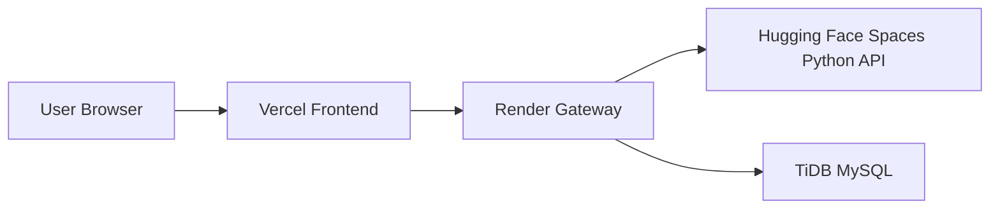

# Free Deployment Guide

This project is already close to a free live deployment. The main pieces are:

- Frontend: Vercel or Render Static Site
- Gateway: Render Web Service
- Python inference service: Hugging Face Spaces
- Database: TiDB Serverless or another free MySQL-compatible host

## Why this setup

The gateway already proxies `/api/*` to the Python service and reads configuration from environment variables. The frontend now supports a configurable API base URL, so it can work both locally and when hosted on a separate domain.

## 1) Python inference service on Hugging Face Spaces

Use the `backend/` folder as the app source.

Required environment variables:

- `PORT` - platform port, default `5001`
- `HOST` - default `0.0.0.0`
- `DERMA_MOCK` - set to `1` if you need to start without native PyTorch

Runtime behavior:

- `GET /api/health` for health checks
- `POST /api/predict` for classification
- `POST /api/gradcam` for heatmaps
- `GET /api/models` and `GET /api/insights` for metadata

If you deploy with Docker, make sure the container starts `python app.py` and listens on the platform port.

## 2) Gateway on Render

Use the `gateway/` folder as the Render service root.

Required environment variables:

- `PORT` - Render provides this automatically
- `INFERENCE_URL` - the public URL of the Hugging Face Space, for example `https://your-space.hf.space`
- `CORS_ORIGINS` - your frontend origin, for example `https://your-frontend.vercel.app`
- `JWT_SECRET` - a long random secret
- `MYSQL_HOST`
- `MYSQL_PORT`
- `MYSQL_DB`
- `MYSQL_USER`
- `MYSQL_PASSWORD`

Production profile:

- start command should activate `prod`
- the gateway already has `application-prod.yml` wired for MySQL

Example start command:

```bash
java -jar target/gateway-1.0.0.jar --spring.profiles.active=prod
```

## 3) Frontend on Vercel

Set the environment variable:

- `VITE_API_BASE_URL` = the Render gateway URL, for example `https://your-gateway.onrender.com`

The frontend will automatically call `https://your-gateway.onrender.com/api`.

Build command:

```bash
npm run build
```

Output directory:

```bash
dist
```

## 4) Database

Use a free MySQL-compatible service such as TiDB Serverless.

The gateway production config expects:

- `MYSQL_HOST`
- `MYSQL_PORT`
- `MYSQL_DB`
- `MYSQL_USER`
- `MYSQL_PASSWORD`

## 5) Deployment order

1. Deploy the Python inference service first.
2. Deploy the gateway and point `INFERENCE_URL` at the Python service URL.
3. Deploy the frontend and point `VITE_API_BASE_URL` at the gateway URL.
4. Set `CORS_ORIGINS` in the gateway to the frontend URL.
5. Test `/api/health`, then test login and image upload.

## 6) Local env examples

Create local env files from the examples in this repo:

- `frontend/.env.example`
- `gateway/.env.example`
- `backend/.env.example`

## Recommended free architecture



## Common failure points

- If the frontend cannot reach the API, check `VITE_API_BASE_URL`.
- If the gateway returns 502, check `INFERENCE_URL`.
- If login or dashboard calls fail from the browser, check `CORS_ORIGINS`.
- If the gateway cannot start on Render, ensure it honors the platform `PORT` env.
- If the Python service fails on Spaces, set `DERMA_MOCK=1` temporarily to verify the deployment pipeline.
